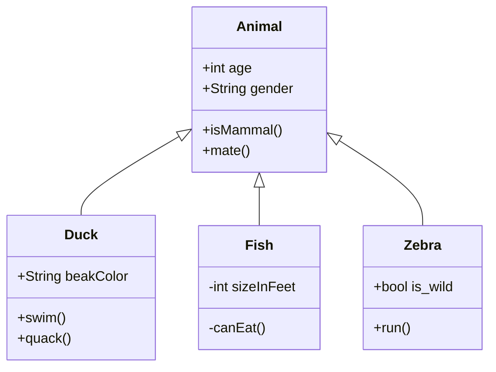

---

title: Hello Word
layout: post
subtitle: Welcome to Jekyll Theme Gungnir
header-img: img/in-post/2022/star.png
header-style: text

header-hide-desc: false

catalog: true
katex: true
mermaid: false
chart: false

tags:
  - Guides
---

## Paragraph

A well-known scientist (some say it was Bertrand Russell) once gave a public lecture on astronomy. He described how the earth orbits around the sun and how the sun, in turn, orbits around the center of a vast collection of stars called our galaxy. At the end of the lecture, a little old lady at the back of the room got up and said: “What you have told us is rubbish. The world is really a flat plate supported on the back of a giant tortoise.” The scientist gave a superior smile before replying, “What is the tortoise standing on.” “You’re very clever, young man, very clever,” said the old lady. “But it’s turtles all the way down!”

Most people would find the picture of our universe as an infinite tower of tortoises rather ridiculous, but why do we think we know better? What do we know about the universe, and how do we know it? Where did the universe come from, and where is it going? Did the universe have a beginning, and if so, what happened before then? What is the nature of time? Will it ever come to an end? Can we go back in time? Recent breakthroughs in physics, made possible in part by fantastic new technologies, suggest answers to some of these longstanding questions. Someday these answers may seem as obvious to us as the earth orbiting the sun – or perhaps as ridiculous as a tower of tortoises. Only time (whatever that may be) will tell.

---

# Syntax Highlighting Theme Classes

```scss
.highlight .hll { background-color: #373b41 }
.highlight .c { color: #969896 } /* Comment */
.highlight .err { color: #cc6666 } /* Error */
.highlight .k { color: #b294bb } /* Keyword */
.highlight .l { color: #de935f } /* Literal */
.highlight .n, .highlight .h { color: #ffffff } /* Name */
.highlight .o { color: #8abeb7 } /* Operator */
.highlight .p { color: #ffffff } /* Punctuation */
.highlight .cm { color: #969896 } /* Comment.Multiline */
.highlight .cp { color: #969896 } /* Comment.Preproc */
.highlight .c1 { color: #969896 } /* Comment.Single */
.highlight .cs { color: #969896 } /* Comment.Special */
.highlight .gd { color: #cc6666 } /* Generic.Deleted */
.highlight .ge { font-style: italic } /* Generic.Emph */
.highlight .gh { color: #ffffff; font-weight: bold } /* Generic.Heading */
.highlight .gi { color: #b5bd68 } /* Generic.Inserted */
.highlight .gp { color: #969896; font-weight: bold } /* Generic.Prompt */
.highlight .gs { font-weight: bold } /* Generic.Strong */
.highlight .gu { color: #8abeb7; font-weight: bold } /* Generic.Subheading */
.highlight .kc { color: #b294bb } /* Keyword.Constant */
.highlight .kd { color: #b294bb } /* Keyword.Declaration */
.highlight .kn { color: #8abeb7 } /* Keyword.Namespace */
.highlight .kp { color: #b294bb } /* Keyword.Pseudo */
.highlight .kr { color: #b294bb } /* Keyword.Reserved */
.highlight .kt { color: #f0c674 } /* Keyword.Type */
.highlight .ld { color: #b5bd68 } /* Literal.Date */
.highlight .m { color: #de935f } /* Literal.Number */
.highlight .s { color: #b5bd68 } /* Literal.String */
.highlight .na { color: #81a2be } /* Name.Attribute */
.highlight .nb { color: #ffffff } /* Name.Builtin */
.highlight .nc { color: #f0c674 } /* Name.Class */
.highlight .no { color: #cc6666 } /* Name.Constant */
.highlight .nd { color: #8abeb7 } /* Name.Decorator */
.highlight .ni { color: #ffffff } /* Name.Entity */
.highlight .ne { color: #cc6666 } /* Name.Exception */
.highlight .nf { color: #81a2be } /* Name.Function */
.highlight .nl { color: #ffffff } /* Name.Label */
.highlight .nn { color: #f0c674 } /* Name.Namespace */
.highlight .nx { color: #81a2be } /* Name.Other */
.highlight .py { color: #ffffff } /* Name.Property */
.highlight .nt { color: #8abeb7 } /* Name.Tag */
.highlight .nv { color: #cc6666 } /* Name.Variable */
.highlight .ow { color: #8abeb7 } /* Operator.Word */
.highlight .w { color: #ffffff } /* Text.Whitespace */
.highlight .mf { color: #de935f } /* Literal.Number.Float */
.highlight .mh { color: #de935f } /* Literal.Number.Hex */
.highlight .mi { color: #de935f } /* Literal.Number.Integer */
.highlight .mo { color: #de935f } /* Literal.Number.Oct */
.highlight .sb { color: #b5bd68 } /* Literal.String.Backtick */
.highlight .sc { color: #ffffff } /* Literal.String.Char */
.highlight .sd { color: #969896 } /* Literal.String.Doc */
.highlight .s2 { color: #b5bd68 } /* Literal.String.Double */
.highlight .se { color: #de935f } /* Literal.String.Escape */
.highlight .sh { color: #b5bd68 } /* Literal.String.Heredoc */
.highlight .si { color: #de935f } /* Literal.String.Interpol */
.highlight .sx { color: #b5bd68 } /* Literal.String.Other */
.highlight .sr { color: #b5bd68 } /* Literal.String.Regex */
.highlight .s1 { color: #b5bd68 } /* Literal.String.Single */
.highlight .ss { color: #b5bd68 } /* Literal.String.Symbol */
.highlight .bp { color: #ffffff } /* Name.Builtin.Pseudo */
.highlight .vc { color: #cc6666 } /* Name.Variable.Class */
.highlight .vg { color: #cc6666 } /* Name.Variable.Global */
.highlight .vi { color: #cc6666 } /* Name.Variable.Instance */
.highlight .il { color: #de935f } /* Literal.Number.Integer.Long */
```

# H1 Heading

## H2 Heading

### H3 Heading

#### H4 Heading

##### H5 Heading

###### H6 Heading


# Text formatting
```
- **Bold**
- _Italics_
- ~~Strikethrough~~
- <ins>Underline</ins>
- <sup>Superscript</sup>
- <sub>Subscript</sub>
- Abbreviation: <abbr title="HyperText Markup Language">HTML</abbr>
- Citation: <cite>&mdash; Chester How</cite>

- **Bold**
- _Italics_
- ~~Strikethrough~~
- <ins>Underline</ins>
- <sup>Superscript</sup>
- <sub>Subscript</sub>
- Abbreviation: <abbr title="HyperText Markup Language">HTML</abbr>
- Citation: <cite>&mdash; Chester How</cite>

# Lists
1. Ordered list item 1
2. Ordered list item 2
3. Ordered list item 3

* Unordered list item 1
* Unordered list item 2
* Unordered list item 3

1. Ordered list item 1
2. Ordered list item 2
3. Ordered list item 3

* Unordered list item 1
* Unordered list item 2
* Unordered list item 3

# Links
Check out tale on [GitHub](https://github.com/chesterhow/tale).
```

Check out tale on [GitHub](https://github.com/chesterhow/tale).


# Code and Syntax Highlighting
Use back-ticks for `inline code`. Multi-line code snippets are supported too through Pygments.

```js
// Sample javascript code
var s = "JavaScript syntax highlighting";
alert(s);
```

```python
# Sample python code
s = "Python syntax highlighting"
print s
```

```c
/* Sample C code */
#include <stdio.h>
int main(){
  printf("C syntax highlighting");
}
```

# Blockquotes

> Curabitur blandit tempus porttitor. Nullam quis risus eget urna mollis ornare vel eu leo. Nullam id dolor id nibh ultricies vehicula ut id elit.



> Curabitur blandit tempus porttitor. Nullam quis risus eget urna mollis ornare vel eu leo. Nullam id dolor id nibh ultricies vehicula ut id elit.

# Horizontal Rule & Line Break

Use `<hr>` for horizontal rules

<hr>

and `<br>` for line breaks.

<br>


Use `<hr>` for horizontal rules

<hr>

and `<br>` for line breaks.

## Code Block

```python
import food

class Dragon:
    def __init__(self, happiness):
        self.happiness = happiness
    def code(self):
        """ just code """
        self.happiness -= 60
    def eat(self, n)
        # just eat
        self.happiness += n * food.size

me = Dragon(100)

while True:
    me.code()
    me.eat(10)
```

## Image


Hey! I am an image!
{:.desc}

## Math

Inline math: $$ E = mc^2 $$

inline: $$f(x) = \int_{-\infty}^\infty \hat f(\xi)\,e^{2 \pi i \xi x} \,d\xi$$

Display mode (centered):

$$f(x) = \int_{-\infty}^\infty \hat f(\xi)\,e^{2 \pi i \xi x} \,d\xi$$

## Chart.js

```chart
{
    "type": "bar",
    "data": {
        "labels": ["Red", "Blue", "Yellow", "Green", "Purple", "Orange"],
        "datasets": [{
            "label": "# of Votes",
            "data": [12, 19, 3, 5, 2, 3],
            "backgroundColor": [
                "rgba(255, 99, 132, 0.2)",
                "rgba(54, 162, 235, 0.2)",
                "rgba(255, 206, 86, 0.2)",
                "rgba(75, 192, 192, 0.2)",
                "rgba(153, 102, 255, 0.2)",
                "rgba(255, 159, 64, 0.2)"
            ],
            "borderColor": [
                "rgba(255, 99, 132, 1)",
                "rgba(54, 162, 235, 1)",
                "rgba(255, 206, 86, 1)",
                "rgba(75, 192, 192, 1)",
                "rgba(153, 102, 255, 1)",
                "rgba(255, 159, 64, 1)"
            ],
            "borderWidth": 1
        }]
    },
    "options": {
        "scales": {
            "yAxes": [{
                "ticks": {
                    "beginAtZero": true
                }
            }]
        }
    }
}
```

## mermaid



## Tag

`info`{:.info} `success`{:.success} `warning`{:.warning} `error`{:.error}


## Alert

Info.
{:.info}

Success.
{:.success}

Warning.
{:.warning}

Error.
{:.error}
